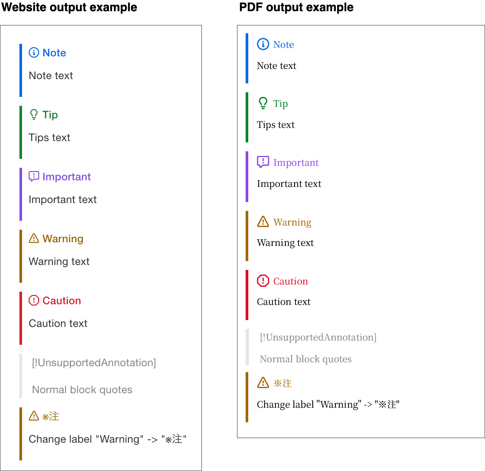

# Honkit plugin Blockquote callout

This Honkit plugin converts blockquotes into GitHub Flavor markdown Alert-like information for both websites and ebooks.

**output example**



**input markdown**

```md
> [!NOTE]
> Note text

<span></span> <!-- The markdown parser used by honkit will treat two blockquotes separated by one or more blank lines as the same blockquote -->

> [!TIP]
> Tips text

<span></span>

> [!IMPORTANT]
> Important text

<span></span>

> [!WARNING]
> Warning text

<span></span>

> [!CAUTION]
> Caution text

<span></span>

> [!UnsupportedAnnotation]
>
> Normal block quotes

<span></span>

> [!Warning|title:※注]
>
> Change label "Warning" -> "※注"
>
```

## Installation

1. Install this plugin.
2. Add this plugin to your `book.json` file.

**Example `book.json`**

```json
{
  "plugins": [
    "blockquote-callout"
  ]
}
```

## Motivation

This plugin was created as an alternative to plugins that use web fonts (e.g. fontawesome) that are not embedded during PDF generation.
